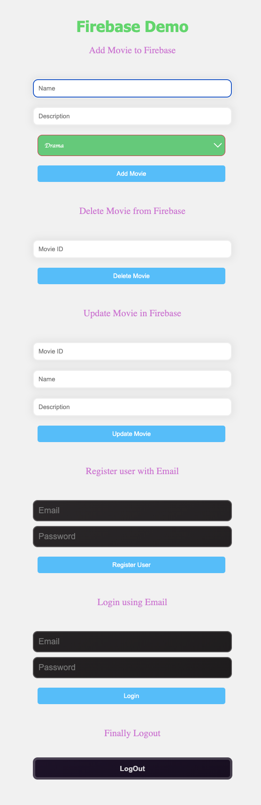

# Exploring Firebase

## Dot env configuration with webpack

The instructions from this [stackoverflow link](https://stackoverflow.com/questions/46224986/how-to-pass-env-file-variables-to-webpack-config)

``` shell
# install dependency
npm install dotenv --save
```
Once the `package` is installed, update the `webpack.config.js`:

``` javascript
const webpack = require('webpack'); // only add this if you don't have yet

// replace accordingly './.env' with the path of your .env file
require('dotenv').config({ path: './.env' });
```

and finally update the `plugins` section with below

``` javascript
    plugins: [
        new webpack.DefinePlugin({
            "process.env": JSON.stringify(process.env)
        })
    ],
```

After updating the `package.json` with the build command, run `npm run build`.

``` shell
❯ npm run build

> unwiredjs@1.0.0 build
> webpack

asset bundle.js 1.43 MiB [emitted] (name: main)
runtime modules 891 bytes 4 modules
modules by path ./node_modules/ 1.27 MiB
  modules by path ./node_modules/@firebase/ 1.24 MiB
    modules by path ./node_modules/@firebase/auth/dist/esm2017/*.js 376 KiB 2 modules
    + 6 modules
  modules by path ./node_modules/firebase/ 971 bytes
    ./node_modules/firebase/app/dist/index.esm.js 826 bytes [built] [code generated]
    ./node_modules/firebase/firestore/dist/index.esm.js 75 bytes [built] [code generated]
    ./node_modules/firebase/auth/dist/index.esm.js 70 bytes [built] [code generated]
  modules by path ./node_modules/idb/build/*.js 10.4 KiB
    ./node_modules/idb/build/index.js 3.09 KiB [built] [code generated]
    ./node_modules/idb/build/wrap-idb-value.js 7.32 KiB [built] [code generated]
  ./node_modules/tslib/tslib.es6.mjs 15.9 KiB [built] [code generated]
./src/index.js 4.69 KiB [built] [code generated]
webpack 5.89.0 compiled successfully in 277 ms
asset bundle.js 1.43 MiB [emitted] (name: main)
cached modules 1.27 MiB [cached] 14 modules
runtime modules 891 bytes 4 modules
./src/index.js 4.52 KiB [built] [code generated]
webpack 5.89.0 compiled successfully in 30 ms
```

Start a local web server to access the `html` over browser. Here, I started a local `python` web server over port `5500`.

```shell
❯ python3 -m http.server 5500
```

Now, the page with form fields can be accessed over `http://localhost:5500/dist/index.html` and it looks as shown below:

[]
